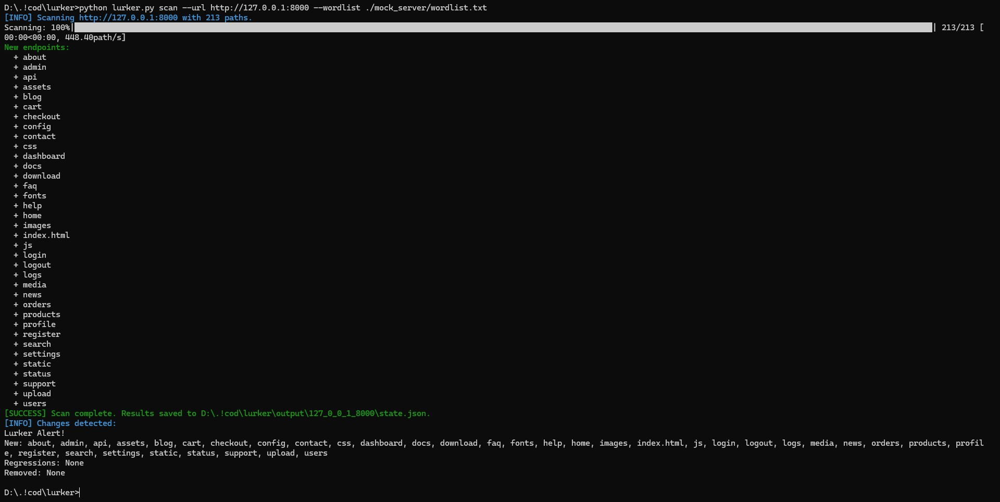
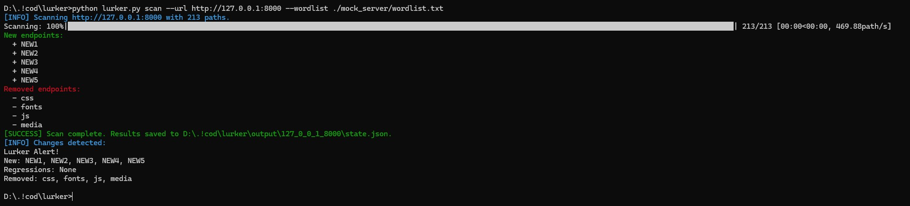

# Lurker 🕵️‍♂️
A lightweight endpoint reconnaissance tool I built for developers who want to keep an eye on their apps. Scans a website, looks for exposed paths, audits the security headers, and warns about changes in paths/headers.

I made this to practice connecting messy network probing with more organized security monitoring.

## interesting-enough features
* Uses **multi-threading** to check endpoints quickly.
* Checks for important HTTP **security headers** in found pages.
* Tracks scan state over time, so you can tell when a new endpoint appears or a security header disappears.
* Able to send alerts to Discord (webhook) when changes are detected.

## Tech stack
* Python 3.x
* No required external dependencies
* Optional: `colorama` for colored output, `tqdm` for a progress bar
* Builtin: `urllib`, `concurrent.futures`, `json`, `argparse`

## Getting started
```bash
git clone https://github.com/PixelDavon/Lurker.git
cd lurker
# optional: makes the terminal output look nicer
pip install colorama tqdm
```

## How to use

### 1. Scan a site
```bash
python lurker.py scan --url http://example.com --wordlist paths.txt
```

Optional flags for `scan`:
* `--max-threads` - maximum concurrent scan threads, default is `8`
* `--webhook-url` - Discord webhook URL for alerts
* `--output-dir` - where scan state is stored, default is `./output`
* `--config` - path to a `config.json` file

### 2. Compare changes
To see what changed between two saved scan states (for example, compare a timestamped history snapshot with the current `state.json`):

```bash
# File order MATTERS
# python lurker.py diff BEFORE.json AFTER.json
python lurker.py diff output/example_com/history/YYYY-MM-DD_HHMM.json output/example_com/state.json
```

Optional flags for `diff`:
* `--webhook-url` - Discord webhook URL for alerts

## Screenshots (example)



## Config file
To avoid typing the same settings every time, add a `config.json` file in the project root.

```json
{
  "max_threads": 8,
  "webhook_url": "https://discord.com/api/webhooks/example",
  "output_dir": "./output"
}
```

CLI flags always override values from the config file.

## How it stores state
Lurker saves scan results in `output/<sanitized_hostname>/state.json`.

Each scan also writes a timestamped copy into `output/<sanitized_hostname>/history/`.
These files are named like `YYYY-MM-DD_HHMM.json`, so you can keep older snapshots and compare them manually.

e.g. scanning `http://example.com` saves state to:

```text
output/example_com/state.json
```

The saved state is a JSON dictionary that maps each path to a small object with `status` and `headers`.

Only a few security-related headers are stored, and they are saved in lowercase (for consistency):
* `server`
* `x-powered-by`
* `content-security-policy`
* `x-frame-options`
* `strict-transport-security`

Example history file path:

```text
output/example_com/history/2025-06-17_1430.json
```

## How the diff works
After a scan, Lurker compares the new results against the previous state and reports:
* **New** - endpoints that were not seen before
* **Regressions** - a status code changed, or a security header that used to exist is now missing
* **Removed** - endpoints that used to respond but no longer do

If changes are found, Lurker prints a summary to the terminal. (or a Discord alert given a webhook url)

To compare two older snapshots, use the `diff` command with any two saved files from `state.json` or the `history/` folder.

## Preflight check
Before the full scan starts, Lurker does a quick probe of the base URL. If the connection looks refused and the wordlist has more than one entry, it asks before continuing.

## Wordlist format
The wordlist is just plain text:
* one path per line
* lines starting with `#` are ignored

Example:

```text
admin
config
.env
api/v1
# ignore-this
```

## Running the tests
The tests use `unittest` and `unittest.mock`, so they do not make real network calls.

```bash
python -m unittest discover -v
```
(or just run `test_lurker.py`)
## Small notes
* Probe requests use a 5 second timeout.
* Discord webhook requests use a 10 second timeout.
* The tool does not store every header, only the ones that matter for basic security checks.
* The saved state is overwritten with the latest scan results.

